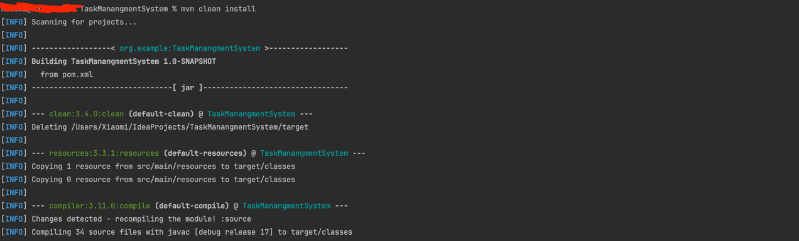
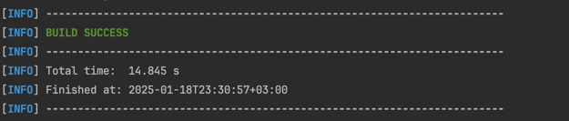
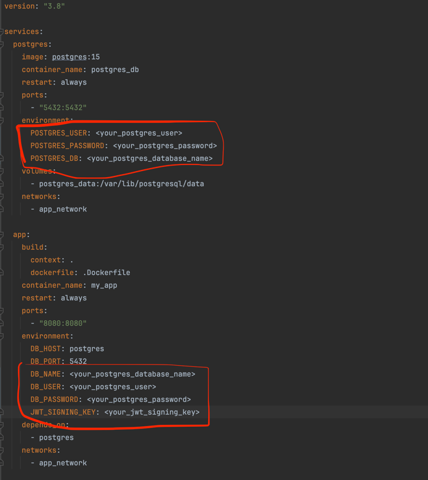
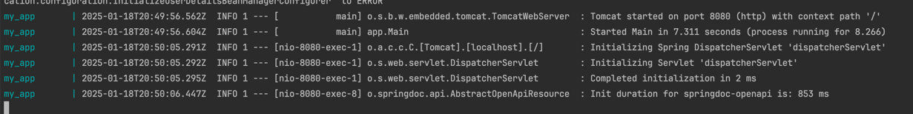
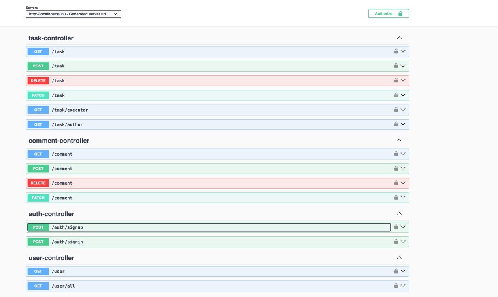

# Task Management System
Добро пожаловать в ситему управления задачами

## Tutorial по развертке проекта
1. Соберите проект мавен с помощью команды ```mvn clean install``` в командной строке или в ide



2. В конце должны быть строки



3. Создайте локально базу данных для приложения и заполните нужные данные в файле compose.yaml



В JWT_SIGNING_KEY надо прописать случайный ключ авторизации (jwt secret), его можно сгенерировать на сайте [https://jwtsecret.com/generate](https://jwtsecret.com/generate)

4. В командной строке пропишите команду ```docker-compose up```
   
5. Приложение должно заработать на 8080 порту, об этом также должны свидетельствовать строки на фото ниже, после развертки приложения docker-compose



6. По ссылке [http://localhost:8080/swagger-ui/index.html#/](http://localhost:8080/swagger-ui/index.html#/) должно быть доступно api приложения 


